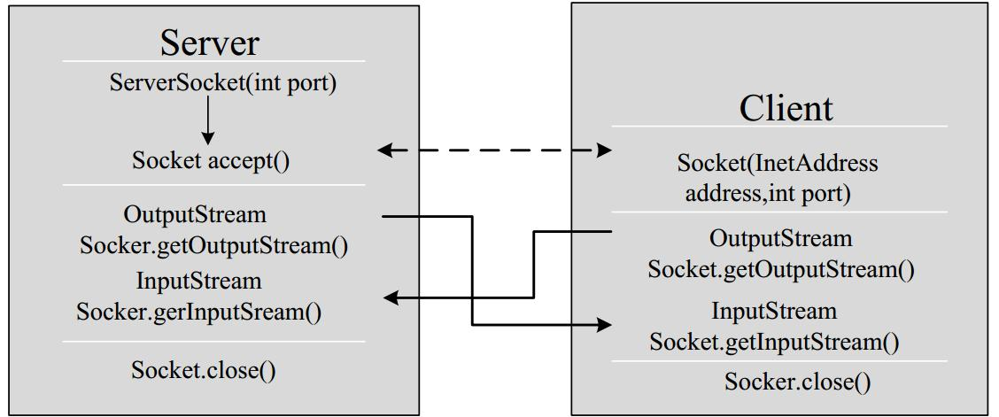
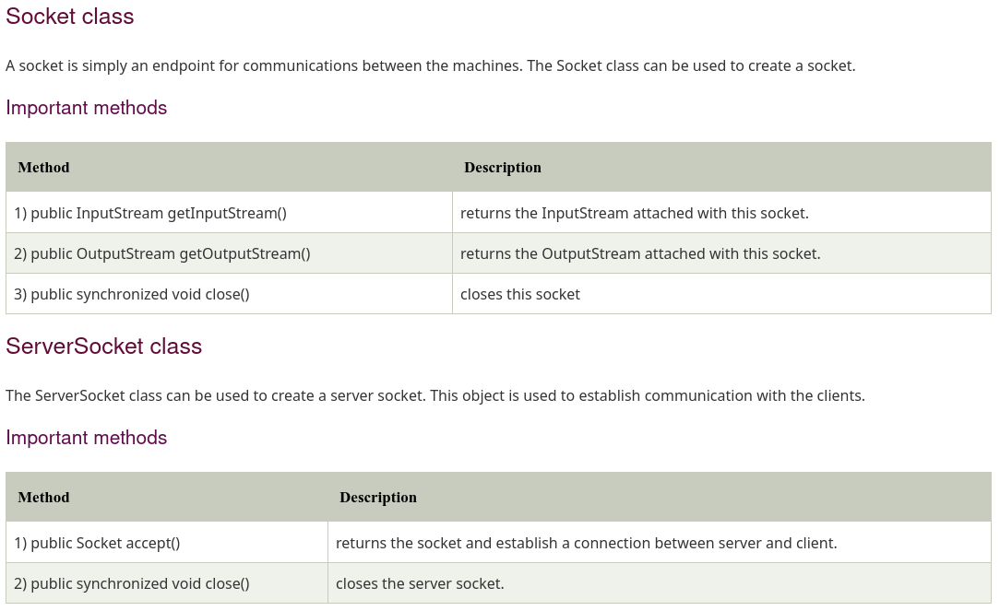

# Exercise Protocol Design

## Protocol objectives

Il permet d'établir une liaison client-serveur afin de calculer un calcule donné.

## Overhall behavior

### What transport protocol do we use?

Les sockets :).

### How does the client find the server (addresses and ports)?

Il faut les spécifier, une fois qu'il les a, il demandera au serveur d'initier la connexion.

### Who speaks first?

Le client.

### Who closes the connection and when?

Le client, le serveur est toujours disponible.

## Messages

### What is the syntax of the messages?

Il y a besoin d'un outputstream

### What is the sequence of messages exchanged by the client and the server? (flow)



### What happens when a message is received from the other party? (semantics)

Il est interprété.

## Specific elements

### Supported operations



### Error handling

YES

### Extensibility

YES

## Examples

### Client

```java
    import java.io.*;  
    import java.net.*;  
    public class MyServer {  
        public static void main(String[] args){  
            try{  
                ServerSocket ss=new ServerSocket(6666);  
                Socket s=ss.accept();//establishes connection   
                DataInputStream dis=new DataInputStream(s.getInputStream());  
                String  str=(String)dis.readUTF();  
                System.out.println("message= "+str);  
                ss.close();  
            } catch(Exception e){
            	System.out.println(e);
            }  
        }  
    }  
```

### Serveur

```java
    import java.io.*;  
    import java.net.*;  
    public class MyClient {  
        public static void main(String[] args) {  
            try{      
                Socket s=new Socket("localhost",6666);  
                DataOutputStream dout=new DataOutputStream(s.getOutputStream());  
                dout.writeUTF("Hello Server");  
                dout.flush();  
                dout.close();  
                s.close();  
            }catch(Exception e){
                System.out.println(e);
            }  
        }  
    }  
```